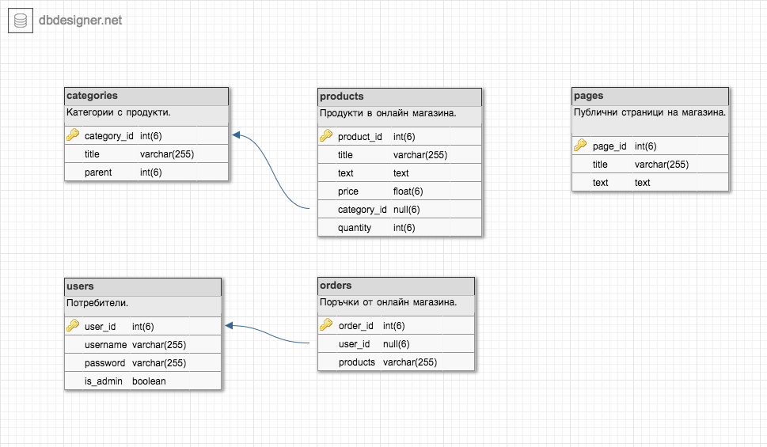

# CSCB025
CSCB025 - Практика по програмиране и реализация на бази данни

# Описание
Онлайн магазин - Самостоятелна работа по програмиране и реализация на бази от данни.

[Cloudformation](https://eu-west-1.console.aws.amazon.com/cloudformation/home?region=eu-west-1#/stacks/create/review?templateURL=https://raw.githubusercontent.com/miglen/CSCB025/master/cscb025_cloudformation_template.yml&stackName=cscb025)

# Технологии
 * Език за програмиране: PHP
  * Клас за темплейти: [Plates](http://platesphp.com/)
  * Клас за потребители: [PHPAuth](https://github.com/PHPAuth/PHPAuth)
 * База от данни: MySQL
 * Външен вид: [Obaju](https://bootstrapious.com/p/obaju-e-commerce-template) от [Ondrej Svestka](http://ondrejsvestka.cz/)
 * Уеб сървър: Apache
 * Хостинг: AWS

# Структура на базата от данни

 * Продукти (products)
   * product_id - Уникален идентификатор
   * title - Заглавие
   * text - Описание
   * category_id - Категория (category_id)
   * price - Цена
   * quantity - Количество
 * Категории (categories)
   * category_id - Уникален идентификатор
   * title - Заглавие
   * parent - Категория родител
 * Страници (pages)
   * page_id - Уникален идентификатор
   * title - Заглавие
   * text - Текст
 * Потребители (users)
   * user_id - Уникален идентификатор
   * username - Потребителско име
   * password - Парола (SHA512 хеширана)
   * is_admin - Администратор?
 * Поръчки (orders)
   * id - Уникален идентификатор
   * user_id - Потребител
   * products - Списък от закупени продукти

# Структура на хранилището

 * README.md - Прочети ме (този файл)
 * cscb025_cloudformation_template.yml - CloudFormation темплейт за инсталация на магазина.
 * ./files/
   * ./php - PHP файлове с основна функционалност
   * ./css - Статични CSS файлове 
   * ./js - Java Script статични файлове

# Инсталация
 - git, mysql, php, php composer
 - cd /var/www/html
 - git clone https://github.com/miglen/CSCB025.git
 - composer install

# TODO:

 - [x] _Да инсталирам pma за дб-то_
 - [x] _Да вкарам категории и да настроя навигацията_
 - [x] _Да вкарам страници и да ги напълня с WYSIWYG редактор (онлайн)._
 - [x] _Да направя търсенето да работи в страници и продукти._
 - [x] Да вкарам продукти и да ги визуализирам
 - [x] Да инсталирам и конфигурирам клас за управление на потребителите - вход/изход,регистрация. Ако нивото е администратор - линк към администрация.
 - [x] Търсенето да работи за страници и продукти.
 - [x] Свързване на всички линкове във футъра
 - [x] Да оптимизирам директориите да показват и продукти в под-директориите.
 - [x] Оптимизиране на изгледа на регистрацията, да не работи ако потребителя е влязъл.
 - [ ] Страница за профил с опция за редакция, да не работи ако потребителя не е влязъл.
 - [ ] ЧЗВ и примерни въпроси/отговори.
 - [ ] Кошница - първоначална страница
 - [ ] Кошница - поръчките да се запазват в дб, страница с поръчки
 - [ ] База с контакти, в която да се пазят записите от формата за контакт + абонамент.
 - [ ] Страница с кошница, продуктите да се добавят в нея.
 - [ ] Администрация - първоначален изглед и логин
 - [ ] Администрация CRUD категории
 - [ ] Администрация CRUD страници
 - [ ] Администрация CRUD продукти
 - [ ] Администрация CRUD поръчки
 - [ ] Оптимизиране на темплейтите и файловете
 - [ ] Оптимизиране на заявките, индексиране
 - [ ] Запълване на страниците със съдържание
 - [ ] Добавяне на допълнителни продукти +10.
 - [ ] Оформяне на инсталационните скриптове за AWS
 - [ ] Обновяване на readme, диаграми и схеми.
 - [ ] Готов за предаване.
